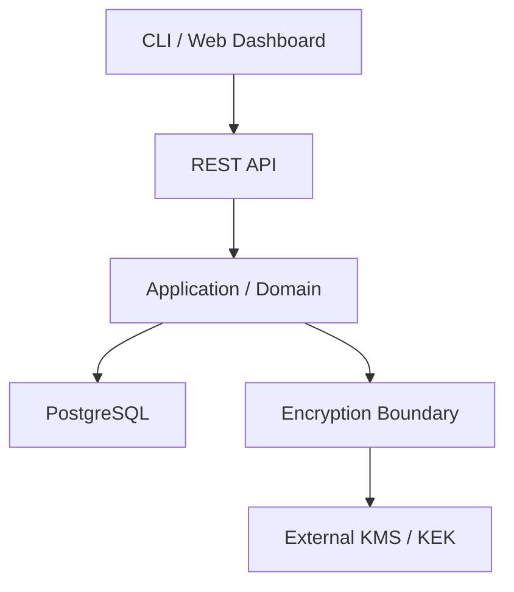

# Laf Secrets

[](https://github.com/laflabs-inc/lafwall/actions/workflows/ci.yml)


[한국어](README.md) | **English**

Laf Secrets is LafLabs' API-first secret-management platform for safely
storing, versioning, and governing access to application secrets.

It is more than a key-value store. Encryption boundaries, deny-by-default
authorization, immutable version history, and auditability form one consistent
security boundary.

> **Development status:** This project is in early development and is not
> ready for production. The database baseline, RBAC, and stable REST API are
> not implemented. Production mode intentionally fails closed.

## Highlights

- AES-256-GCM envelope encryption with an independent DEK per secret version
- Versioned AAD binding tenant, project, environment, secret, and version context
- OIDC human identity boundary with exact issuer, audience, and algorithm checks
- Service tokens using CSPRNG opaque credentials and constant-time verifiers
- Explicit separation between secret-value and metadata operations
- Deny-by-default authorization for every resource operation
- Append-only audit-log design committed atomically with state changes
- One REST API contract shared by the CLI and web dashboard

## Implementation status

<!-- markdownlint-disable MD013 -->

| Area | Status | Notes |
| --- | --- | --- |
| Repository and CI foundation | Complete | Includes race tests, `govulncheck`, and Gitleaks |
| Envelope encryption | Complete | Production `KekProvider` is not selected |
| Human OIDC identity | Complete | Remote JWKS and HTTP wiring are deferred |
| Service tokens | Complete | One-time reveal, expiry, revocation, exact tenant scope |
| RBAC | Next slice | The exact role matrix requires separate approval |
| PostgreSQL and REST API | Not started | Migration and public-contract approval required |

<!-- markdownlint-enable MD013 -->

The [roadmap](docs/roadmap.md) defines the detailed order and exit criteria.

## Target architecture



The REST API is the only external product contract. Domain and application
policy remain independent of HTTP, PostgreSQL, OIDC, and KMS adapters. The
backend stays a single modular-monolith deployment until operational evidence
justifies extraction.

## Quick start

### Requirements

- Go 1.26.5
- GNU Make or a compatible `make`
- Git for history-aware secret scanning

### Install and verify

```sh
git clone https://github.com/laflabs-inc/lafwall.git
cd lafwall
make check
```

### Run in development mode

```sh
export LAFSECRETS_RUNTIME_MODE=development
make run
```

The default address is `127.0.0.1:8080`. Only operational probes, not product
API endpoints, are currently exposed.

```sh
curl -i http://127.0.0.1:8080/livez
curl -i http://127.0.0.1:8080/readyz
```

Both endpoints return `204 No Content` with an empty body while healthy.

## Configuration

<!-- markdownlint-disable MD013 -->

| Environment variable | Required | Default | Description |
| --- | --- | --- | --- |
| `LAFSECRETS_RUNTIME_MODE` | Yes | None | Only `development` can run; `production` fails closed |
| `LAFSECRETS_HTTP_ADDRESS` | No | `127.0.0.1:8080` | Listen address in valid `host:port` form |

<!-- markdownlint-enable MD013 -->

Unknown `LAFSECRETS_*` variables, duplicate values, malformed input, and port
`0` fail startup. Rejected values are not copied into errors.

## Development commands

<!-- markdownlint-disable MD013 -->

| Command | Purpose |
| --- | --- |
| `make build` | Build the `bin/lafsecrets` binary |
| `make run` | Run the local service |
| `make format` | Format Go source |
| `make lint` | Check formatting and run `go vet` |
| `make test` | Run unit and integration tests with the race detector |
| `make audit` | Verify modules and run `govulncheck` |
| `make scan-secrets` | Scan the current worktree for secret patterns |
| `make check` | Run the complete local quality gate |
| `make ci` | Run CI, including the Git-history scan |

<!-- markdownlint-enable MD013 -->

## Repository layout

<!-- markdownlint-disable MD013 -->

| Path | Responsibility |
| --- | --- |
| `cmd/lafsecrets` | Service entry point and graceful shutdown |
| `internal/config` | Fail-closed runtime configuration |
| `internal/encryption` | Envelope encryption and the `KekProvider` port |
| `internal/identity` | OIDC human identity boundary |
| `internal/servicetoken` | Opaque service-token issuance and authentication |
| `internal/health` | Readiness lifecycle |
| `internal/httpserver` | HTTP server and operational probes |
| `docs/adr` | Accepted architecture decision records |
| `docs/rfc` | Accepted product and security policy |
| `docs/security` | Security invariants, threat model, and boundaries |

<!-- markdownlint-enable MD013 -->

## Documentation

The detailed project documentation is maintained in Korean while code
identifiers and standards terms remain in English.

<!-- markdownlint-disable MD013 -->

| Document | Purpose |
| --- | --- |
| [Development guide](docs/development.md) | Toolchain, startup, tests, CI, and probes |
| [Roadmap](docs/roadmap.md) | Phase slices and exit criteria |
| [Security invariants](docs/security/security-invariants.md) | Highest-priority security contract |
| [Threat model](docs/security/threat-model.md) | Assets, trust boundaries, threats, and controls |
| [Encryption boundary](docs/security/encryption-boundary.md) | Envelope format, AAD, and `KekProvider` contract |
| [Human identity boundary](docs/security/human-identity-boundary.md) | OIDC trust and token-validation contract |
| [Service token boundary](docs/security/service-token-boundary.md) | Opaque credential, verifier, and lifecycle contract |
| [Domain contract](docs/domain/domain-contract.md) | Entities, lifecycle, and storage invariants |
| [ADR-0001](docs/adr/0001-api-first-modular-monolith.md) | API-first modular-monolith decision |
| [ADR-0002](docs/adr/0002-go-postgresql-backend.md) | Go and PostgreSQL backend decision |
| [RFC-0001](docs/rfc/0001-mvp-policy-boundaries.md) | MVP identity, tenant, environment, and RBAC boundaries |
| [Phase 0 decision record](docs/decisions-required.md) | Approved decisions and remaining gates |

<!-- markdownlint-enable MD013 -->

## Security principles

- Never place real secrets or production credentials in source, fixtures,
  snapshots, logs, errors, telemetry, or audit events.
- Authorize every resource operation with deny-by-default policy.
- Treat ciphertext, wrapped DEKs, tokens, backups, and audit records as
  sensitive.
- Fail closed when authentication, authorization, encryption, or audit
  persistence fails.
- Keep production KEKs outside the application database.

Changing a security boundary requires explicit approval and a documented
security review before implementation. See the
[security invariants](docs/security/security-invariants.md) for the complete
contract.

## MVP scope

The MVP covers project and environment management, secret CRUD and versioning,
envelope encryption, service tokens, RBAC, an audit log, REST API, CLI, and web
dashboard.

Dynamic secrets, database credential rotation, PKI, SSH certificates, a
Kubernetes Operator, multi-region replication, and HSM integration are
excluded until operational evidence and separate approval justify them.
