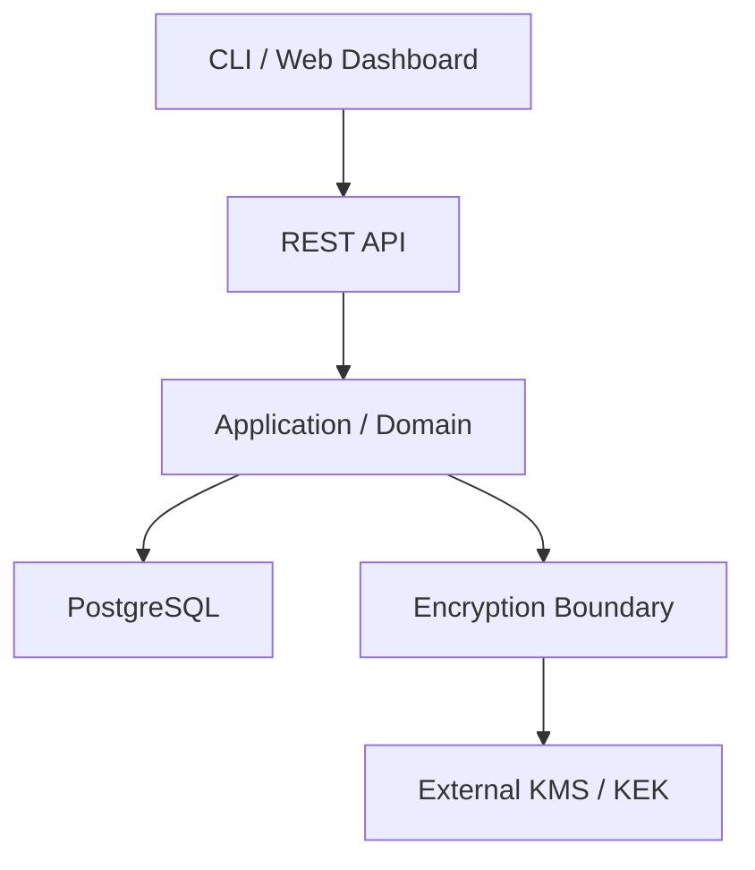

# Laf Secrets

[](https://github.com/laflabs-inc/lafwall/actions/workflows/ci.yml)


**한국어** | [English](README.en.md)

Laf Secrets는 애플리케이션 Secret을 안전하게 저장하고, 버전을 관리하며,
접근을 통제하기 위한 LafLabs의 API-first Secret Management Platform입니다.

단순한 Key-Value Store가 아니라 Encryption Boundary, deny-by-default
Authorization, immutable Version History, Auditability를 하나의 일관된
Security Boundary로 제공합니다.

> **개발 상태:** 현재 초기 개발 단계이며 Production에서 사용할 수 없습니다.
> Database baseline과 stable REST API는 아직 구현되지 않았고,
> Production mode는 의도적으로 fail-closed 처리됩니다.

## 주요 특징

- Secret Version마다 독립된 DEK를 사용하는 AES-256-GCM Envelope Encryption
- Tenant·Project·Environment·Secret·Version context를 묶는 versioned AAD
- exact issuer·audience·algorithm 검증을 수행하는 OIDC Human Identity Boundary
- CSPRNG opaque credential·constant-time verifier를 사용하는 Service Token
- Secret value와 metadata operation의 명시적 분리
- 고정 Role·Permission과 하향 scope를 적용하는 deny-by-default Authorization
- state change와 atomic하게 기록할 append-only Audit Log 설계
- CLI·Web Dashboard가 함께 사용할 단일 REST API 계약

## 구현 현황

<!-- markdownlint-disable MD013 -->

| 영역 | 상태 | 비고 |
| --- | --- | --- |
| Repository·CI foundation | 완료 | race test, `govulncheck`, Gitleaks 포함 |
| Envelope Encryption | 완료 | Production `KekProvider`는 미선정 |
| Human OIDC Identity | 완료 | remote JWKS·HTTP wiring은 후속 작업 |
| Service Token | 완료 | one-time reveal, expiry, revocation, exact Tenant scope |
| RBAC | 완료 | 5개 고정 Role, 19개 Permission, deny-by-default Policy |
| PostgreSQL·REST API | 미착수 | Migration·public contract 승인 필요 |

<!-- markdownlint-enable MD013 -->

상세 진행 순서와 완료 조건은 [Roadmap](docs/roadmap.md)을 기준으로 합니다.

## 목표 Architecture



REST API가 유일한 외부 제품 계약입니다. Domain·Application policy는 HTTP,
PostgreSQL, OIDC, KMS adapter와 분리하며, 운영 근거가 생기기 전까지 하나의
Modular Monolith로 배포합니다.

## 빠른 시작

### 요구 사항

- Go 1.26.5
- GNU Make 또는 호환되는 `make`
- history-aware Secret scan을 위한 Git

### 설치 및 검증

```sh
git clone https://github.com/laflabs-inc/lafwall.git
cd lafwall
make check
```

### Development mode 실행

```sh
export LAFSECRETS_RUNTIME_MODE=development
make run
```

기본 주소는 `127.0.0.1:8080`입니다. 현재 공개된 endpoint는 제품 API가 아닌
운영 probe뿐입니다.

```sh
curl -i http://127.0.0.1:8080/livez
curl -i http://127.0.0.1:8080/readyz
```

정상 상태에서는 두 endpoint 모두 body 없이 `204 No Content`를 반환합니다.

## Configuration

<!-- markdownlint-disable MD013 -->

| 환경 변수 | 필수 | 기본값 | 설명 |
| --- | --- | --- | --- |
| `LAFSECRETS_RUNTIME_MODE` | 예 | 없음 | 현재 `development`만 실행 가능하며 `production`은 fail-closed |
| `LAFSECRETS_HTTP_ADDRESS` | 아니요 | `127.0.0.1:8080` | 유효한 `host:port` 형식의 listen address |

<!-- markdownlint-enable MD013 -->

알 수 없는 `LAFSECRETS_*` 변수, 중복 값, 잘못된 형식, port `0`은 startup을
실패시킵니다. 거부된 값은 error에 복사하지 않습니다.

## 개발 명령

<!-- markdownlint-disable MD013 -->

| 명령 | 설명 |
| --- | --- |
| `make build` | `bin/lafsecrets` binary build |
| `make run` | local service 실행 |
| `make format` | Go source format 적용 |
| `make lint` | format 검사 및 `go vet` 실행 |
| `make test` | race detector를 포함한 unit·integration test 실행 |
| `make audit` | module 검증 및 `govulncheck` 실행 |
| `make scan-secrets` | 현재 worktree의 Secret pattern 검사 |
| `make check` | local quality gate 전체 실행 |
| `make ci` | Git history scan을 포함한 CI 전체 실행 |

<!-- markdownlint-enable MD013 -->

## Repository 구조

<!-- markdownlint-disable MD013 -->

| 경로 | 역할 |
| --- | --- |
| `cmd/lafsecrets` | service entrypoint와 graceful shutdown |
| `internal/config` | fail-closed runtime configuration |
| `internal/encryption` | Envelope Encryption과 `KekProvider` port |
| `internal/identity` | OIDC Human Identity Boundary |
| `internal/servicetoken` | opaque Service Token 발급·인증 boundary |
| `internal/authorization` | deny-by-default RBAC와 grant·revoke Policy |
| `internal/health` | readiness lifecycle |
| `internal/httpserver` | HTTP server와 operational probe |
| `docs/adr` | 승인된 Architecture Decision Record |
| `docs/rfc` | 승인된 Product·Security policy |
| `docs/security` | Security invariant, Threat Model, 구현 boundary |

<!-- markdownlint-enable MD013 -->

## 문서

<!-- markdownlint-disable MD013 -->

| 문서 | 설명 |
| --- | --- |
| [개발 가이드](docs/development.md) | Toolchain, 실행, test, CI, operational probe |
| [Roadmap](docs/roadmap.md) | Phase별 Slice와 완료 조건 |
| [Security Invariants](docs/security/security-invariants.md) | 변경 시 승인이 필요한 최상위 Security 계약 |
| [Threat Model](docs/security/threat-model.md) | 보호 자산, trust boundary, 위협과 통제 |
| [Encryption Boundary](docs/security/encryption-boundary.md) | Envelope format, AAD, `KekProvider` 계약 |
| [Human Identity Boundary](docs/security/human-identity-boundary.md) | OIDC trust와 token validation 계약 |
| [Service Token Boundary](docs/security/service-token-boundary.md) | opaque credential, verifier, lifecycle 계약 |
| [Authorization Boundary](docs/security/authorization-boundary.md) | Role matrix, scope, grant·revoke, denial 계약 |
| [Domain Contract](docs/domain/domain-contract.md) | Entity, lifecycle, storage invariant |
| [ADR-0001](docs/adr/0001-api-first-modular-monolith.md) | API-first Modular Monolith 결정 |
| [ADR-0002](docs/adr/0002-go-postgresql-backend.md) | Go·PostgreSQL backend 결정 |
| [RFC-0001](docs/rfc/0001-mvp-policy-boundaries.md) | MVP Identity·Tenant·Environment·RBAC 경계 |
| [RFC-0002](docs/rfc/0002-mvp-rbac-matrix.md) | MVP deny-by-default RBAC matrix |
| [Phase 0 결정 기록](docs/decisions-required.md) | 승인된 결정과 남은 approval gate |

<!-- markdownlint-enable MD013 -->

## Security 원칙

- 실제 Secret이나 운영 credential을 source, fixture, snapshot, log, error,
  telemetry, audit event에 포함하지 않습니다.
- 모든 resource operation은 deny-by-default로 authorize합니다.
- Ciphertext, Wrapped DEK, token, backup, audit record도 민감정보로 취급합니다.
- Authentication, Authorization, Encryption, Audit persistence 실패는
  fail-closed 처리합니다.
- Production KEK는 Application Database 외부에서 관리합니다.

보안 경계를 변경하려면 구현보다 먼저 명시적 승인과 문서화된 Security
Review가 필요합니다. 자세한 기준은
[Security Invariants](docs/security/security-invariants.md)를 확인하세요.

## MVP 범위

MVP에는 Project·Environment 관리, Secret CRUD·Versioning, Envelope
Encryption, Service Token, RBAC, Audit Log, REST API, CLI, Web Dashboard가
포함됩니다.

Dynamic Secrets, Database Credential Rotation, PKI, SSH Certificate,
Kubernetes Operator, Multi-region Replication, HSM Integration은 MVP에서
제외합니다. 실제 운영 근거와 별도 승인이 생기기 전에는 미리 구현하지
않습니다.
